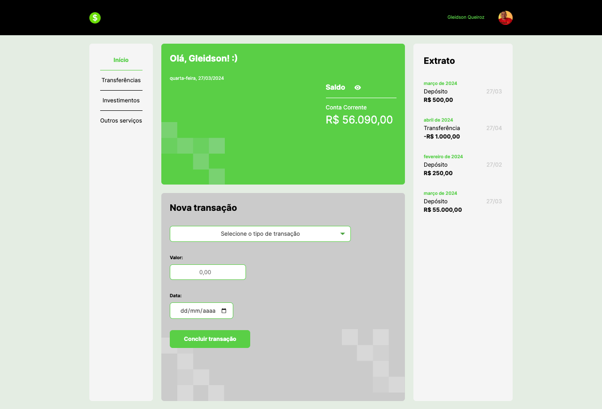

# TypeBank

 

## O Projeto
A aplicação que foi desenvolvida faz registro de transações em uma conta do Typebank. Utilizando o formulário de novas transações, a pessoa usuária pode registrar transferências, fazer depósitos, fazer pagamentos de boleto, ou qualquer outra ação que determinarmos na aplicação.

## Tecnologias utilizadas no projeto
* HTML
* CSS
* JavaScript
* TypeScript

<table>
  <tr>
    <td>
     
    </td>
    <td>
      Feito por Gleidson Queiroz.</a> 🙋🏼‍♂️
    </td>
  </tr>
</table>
